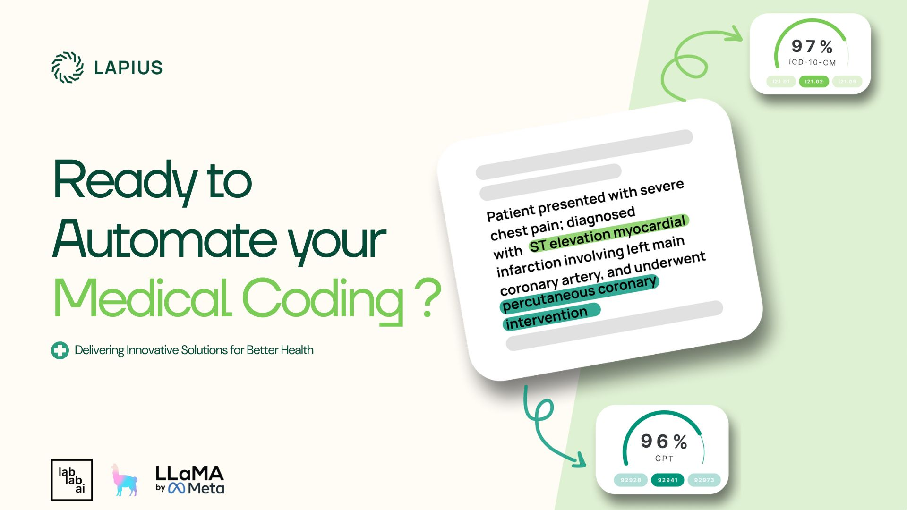
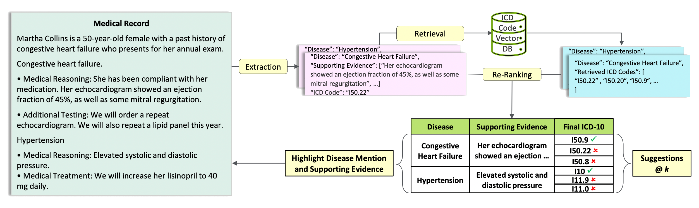
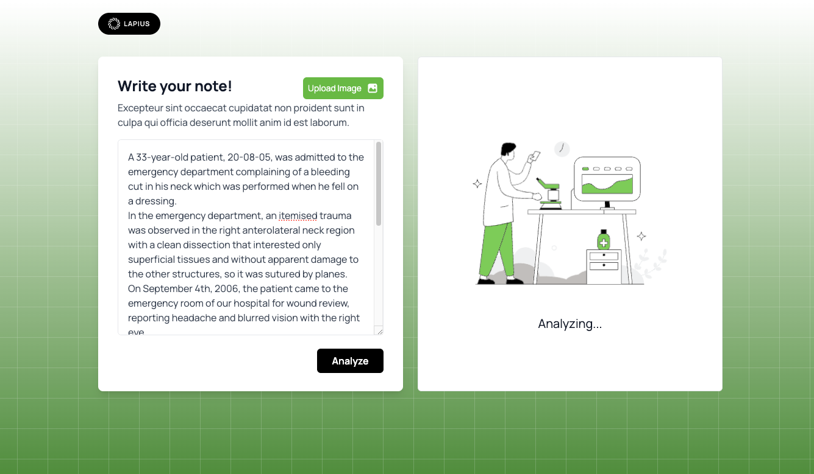
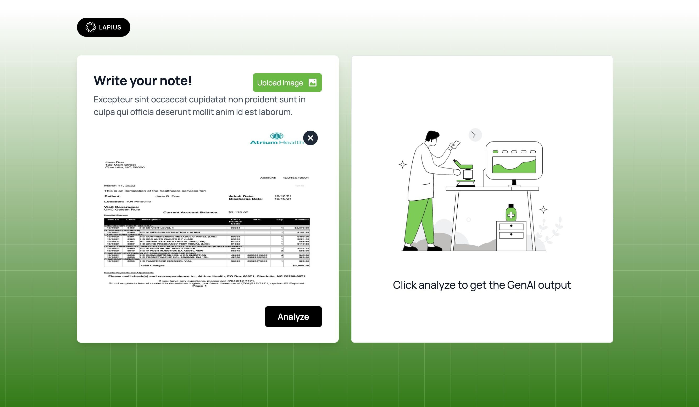
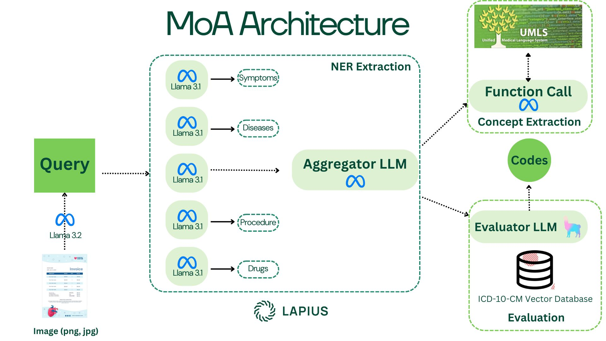

#  Lapius: Automatic Medical Coderr

**Lapius** is a powerful Multi-agent application that empowers medical coders and patients to extract medical codes (ICD-10-CM) from medical records or explain the meaning of codes found in medical bills or EOB. By leveraging the advanced capabilities of LLaMA 3.1 (405B and 90B) and the multimodl LLaMA 3.2 (11B) models, Lapius allows you to work with both textual data and images.  

---

## Table of Contents

- [Features](#features)
- [How It Works](#how-it-works)
- [Usage](#usage)
- [Technical Details](#technical-details)
- [Limitations and Next steps](#limitation-and-next-steps)
- [License](#license)

---

## Features

- **Eplain codes from your itemised bill or EOB**: By uploading an image of your medical receipt, the model will be able to extract the codes and tell you what they mean and what disease or procedure they are associated with. .
- **Extract ICD-10-CM codes from clinical note**: Automatically extract ICD-10-CM codes from any textual clinical note.
- **Self-explanatory**: The solution is able to identify the text references in the clinical note to help the medical coder or patient.
- **Reranking**: By leveraging a multi-agent workflow, Lapius can rerank the codes from most to least likely.

---

## How It Works

1. **Define Your Use Case**: Start by specifying the purpose of your chatbot.Decide whether you want to upload a medical bill or paste the text of a medical diagnosis. 
2a. **Upload Documents**: Enhance your chatbot's knowledge base by uploading an itimised bill or EOB document.
2b. **Paste your clinical note**: Utilize a Mixture-of-Agents architecture to extract the medical codes.
3. **Get the results**: One section will be devoted to the exploration of response with text references and alternative codes. .

---

## Usage

1. **Launch the App**: Click on the link.
2. **Create a New Chatbot**:
    - Click on the **"Create Chatbot"** button.
    - Enter your **use case** and provide **examples**.
    - Optionally, **upload documents** to enrich the chatbot's knowledge.
3. **Generate Dataset**:
    - The app uses LLaMA 3.1 (405B) to create a synthetic dataset based on your inputs.
4. **Fine-Tune the Model**:
    - Initiate the fine-tuning process using LLaMA 3.2 (1B). This process takes approximately 10 minutes and requires an internet connection.
5. **Deploy Locally**:
    - Once fine-tuned, your chatbot is available for offline use. You can interact with it without needing an internet connection.
6. **Manage Models**:
    - The app limits the number of concurrently downloaded models to manage device memory efficiently. You can download and deploy multiple chatbots as needed.
7. **Interact with Documents**:
    - Utilize the document interaction feature to chat with your uploaded documents seamlessly within the app.

---

## Technical Details

- **Frontend**: Built with Flutter for a responsive and intuitive user interface.
- **Backend**: Utilizes an API for dataset generation and model fine-tuning.
- **Models**:
    - **LLaMA 3.1 (405B)**: Used for generating synthetic datasets from use cases or uploaded documents.
    - **LLaMA 3.2 (1B)**: Fine-tuned using the generated dataset to create a customized chatbot.
- **Fine-Tuning Pipeline**: Integrated pipeline to handle data preprocessing, model training, and deployment.
- **Offline Deployment**: Models are stored locally on the device, enabling offline interactions.
- **Security**: Implements robust security measures to ensure data privacy and integrity.

 
---

## Limitations and Next steps

1. **Customer Support**:
    - Create a chatbot that handles frequently asked questions, processes support tickets, and provides real-time assistance to customers.
  
2. **Educational Tutoring**:
    - Develop a tutor chatbot that assists students with homework, explains complex topics, and provides personalized learning resources.
  
3. **Healthcare Assistance**:
    - Build a chatbot to provide preliminary medical advice, schedule appointments, and offer information on healthcare services.
  
4. **E-commerce Recommendations**:
    - Implement a shopping assistant that suggests products based on user preferences, tracks orders, and manages returns.
  
5. **Content Generation**:
    - Generate blog posts, articles, and marketing copy tailored to specific topics and audience demographics.
  
6. **Internal Company Tools**:
    - Develop chatbots for HR queries, IT support, and internal knowledge bases to streamline company operations.
  
7. **Personal Productivity**:
    - Create a personal assistant chatbot that helps manage schedules, set reminders, and organize tasks.
  
8. **Legal Assistance**:
    - Provide preliminary legal information, assist with document preparation, and answer common legal queries.
  
9. **Language Translation and Learning**:
    - Offer translation services and language learning assistance through interactive conversations.
  
10. **Entertainment and Gaming**:
    - Develop interactive characters and story-driven chatbots for games and entertainment platforms.

---

## License

This project is licensed under the [MIT License](LICENSE).

---

**Disclaimer**: This application utilizes large language models which may have limitations in understanding and generating content. Always review and verify the chatbot's responses for accuracy and appropriateness.
